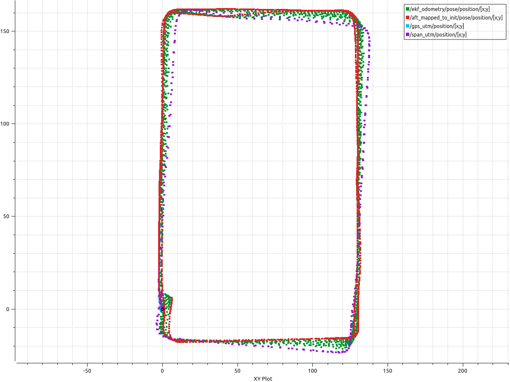
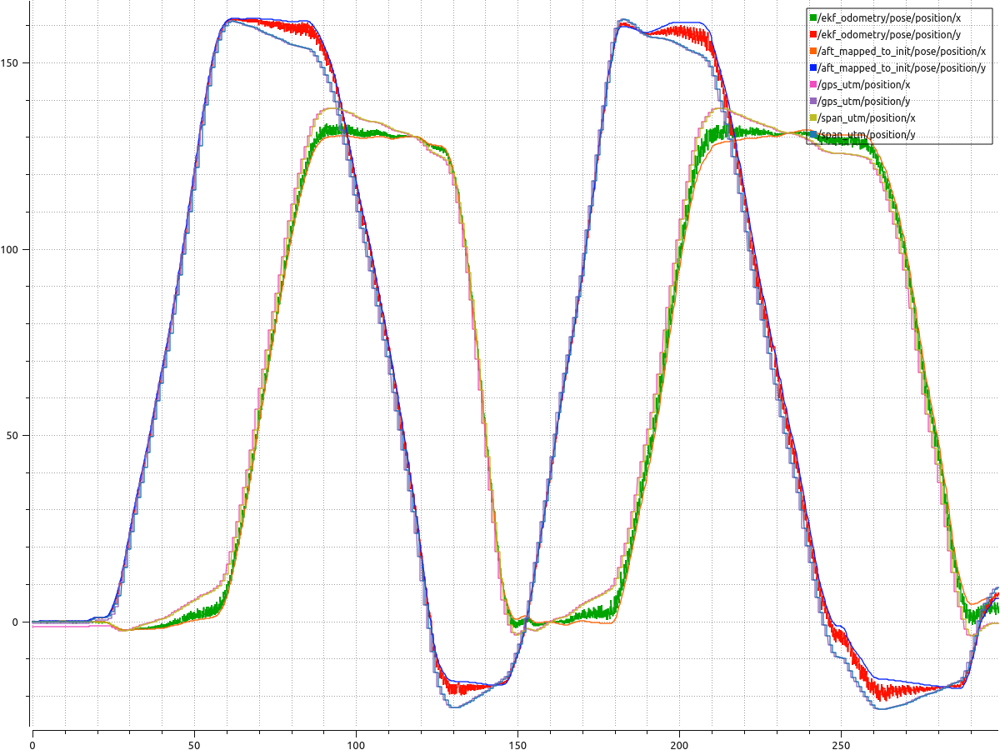
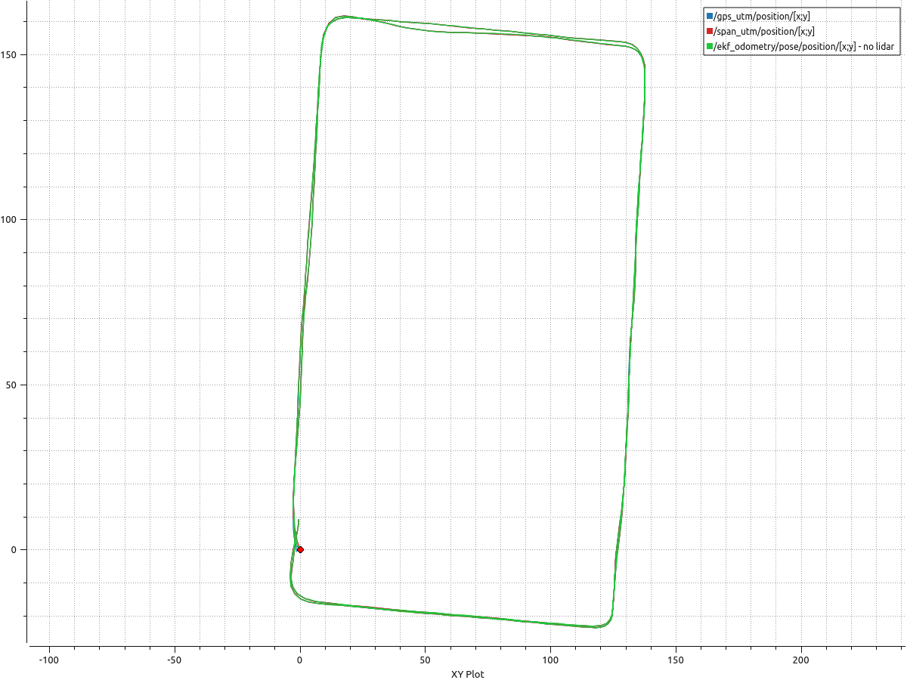
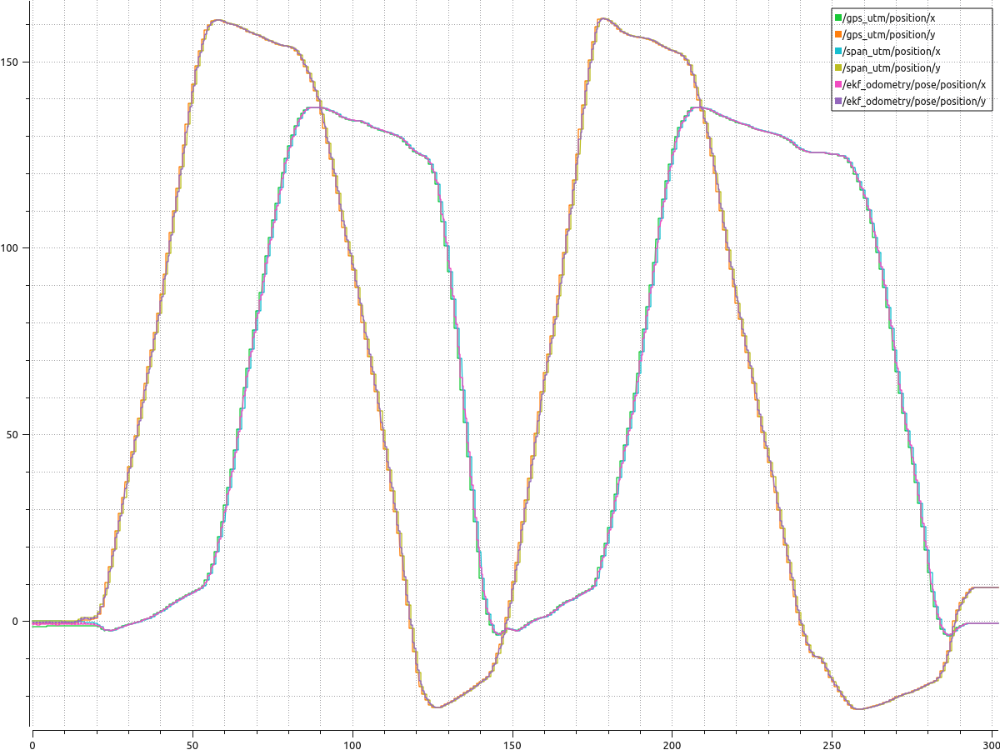
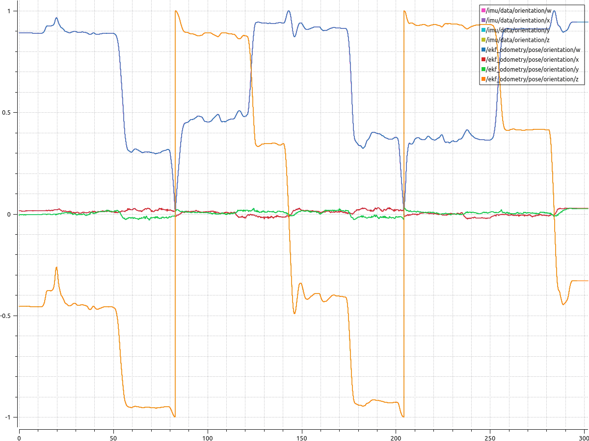

# Simultaneous Localization and Mapping (SLAM) in crowded urban environments by fusing Lidar, IMU, GPS, Odometry, and SPAN-CPT data.

## Kalman Filter details:

  - Number of states tracked: 13 
  - (3 positions, 3 velocities, 3 accelerations and 4 quaternion orientations)
  - State Vector: [x, y, z, vx, vy, vz, ax, ay, az, qx, qy, qz, qw]
    - Position states : (x, y, z)
    - Velocity States : (vx, vy, vz)
    - Acceleration States : (ax, ay, az)
    - Quaternion States: (qx, qy, qz, qw)

## Data used:

### UrbanNav Dataset:
[UrbanNav](https://www.polyu-ipn-lab.com/download) is an Open-Sourcing Localization Dataset collected in Asian Urban Canyons, including Tokyo and Hong Kong. The dataset was developed to aid in solving the challenging problem of positioning and localization in deep urban canyons using low-cost sensors. The accuracy of GNSS is severely challenged in urban canyons due to the high-rising buildings, leading to numerous Non-line-of-sight (NLOS) receptions and multipath effects. Moreover, the excessive dynamic objects can also distort the performance of LiDAR and the camera. The dataset includes sensor measurements from GNSS receiver, LiDAR, camera, and IMU, together with accurate ground truth from [SPAN-CPT](https://novatel.com/products/span-gnss-inertial-navigation-systems) system. 

### Hong Kong Dataset
1. **Sensor Setups**
   The platform for data collection was a Honda Fit. The platform was equipped with the following sensors:
     - 3D LiDAR sensor ([HDL 32E Velodyne](https://velodynelidar.com/products/hdl-32e/)): (360 HFOV, +10~-30 VFOV, 80m range, 10Hz) 
     - IMU ([Xsens Mti 10](https://www.xsens.com/products/mti-10-series), 100 Hz, AHRS)
     - GNSS receiver: u-blox M8T or u-blox F9P (**to be updated**)  
     - camera:(1920X1200,79.4°X96.8°, 10Hz) 
     - [SPAN-CPT](https://www.novatel.com/products/span-gnss-inertial-systems/span-combined-systems/span-cpt/):(RTK GNSS/INS, RMSE: 5cm, 1Hz) 


2. Dataset : UrbanNav-HK-Data20200314
    **Brief**: Dataset UrbanNav-HK-Data2020314 is collected in a low-urbanization area in Kowloon which suitable for algorithmic verification and comparison. The coordinates transformation between multiple sensors, and intrinsic measurements of camera can be found via [Extrinsic Parameters](UrbanNav-HK-Data20200314/extrinsic.yaml), [IMU noise](UrbanNav-HK-Data20200314/xsens_imu_param.yaml) and [Intrinsic Parameters of Camera](UrbanNav-HK-Data20200314/camera_extrinsic.yaml).

<!-- Some key features are as follows: -->
  | Date of Collection | Total Size |Path length |Sensors |
  | :---:  | :---:  |:---:  |:---:  |
  | 2020/03/14 | 27.0 GB|1.21 Km |LiDAR/Camera/IMU/SPAN-CPT |

- Download by Dropbox Link: 
  - [UrbanNav-HK-Data20200314](https://www.dropbox.com/s/3mtlncglrv7p39l/2020-03-14-16-45-35.bag.tar.gz?dl=0) (ROS)
    - ROSBAG file which includes:
      - 3D LiDAR point clouds: ```/velodyne_points```
      - Camera: ```/camera/image_color```
      - IMU: ```/imu/data```
      - SPAN-CPT: ```/novatel_data/inspvax```
  <!-- - [GNSS](https://www.dropbox.com/sh/22mnpg86umjb4zh/AAAsIiQ1WAMp20OROUn4h6pka?dl=0) (RINEX)
    - GNSS RINEX files, to use it, we suggest to use the [RTKLIB](http://www.rtklib.com/) -->

## Requirements:

  - ROS Melodic
  - [A-LOAM](https://github.com/HKUST-Aerial-Robotics/A-LOAM) - To process lidar points and output lidar mapping and odometry data
  - [Novatel Span Driver](https://github.com/ros-drivers/novatel_span_driver)
  - [utm](https://github.com/Turbo87/utm)


## Sensor topics used:

  - /imu/data 
  - /aft_mapped_to_init 
  - /navsat/fix
  - /novatel_data/inspvax


### Steps:
  1. Install ROS melodic from [here](http://wiki.ros.org/melodic/Installation), and [utm](https://github.com/Turbo87/utm).
  2. Setup a ROS workspace with [A-LOAM](https://github.com/HKUST-Aerial-Robotics/A-LOAM) and [Novatel Span Driver](https://github.com/ros-drivers/novatel_span_driver) packages.
  3. Download [rosbag file](https://www.dropbox.com/s/3mtlncglrv7p39l/2020-03-14-16-45-35.bag.tar.gz?dl=0) for the UrbanNav dataset.
  4. Run the following commands via terminal:
   
    roslaunch aloam_velodyne aloam_velodyne_VLP_16.launch
    
    rosbag play 2020-03-14-16-45-35.bag
    
    python sensor_fusion_urbannav.py

  5. The filtered odometry information of the vehicle can be accessed using
   
    rostopic echo /ekf_odometry

## Results:

### Fused localization using LiDAR, GPS, SPAN data 

<p align="center">
  
</p>

### X and Y position tracking using LiDAR, GPS, SPAN data 

<p align="center">
  
</p>

### Fused localization using GPS and SPAN data only
<p align="center">
  
</p>

### X and Y position tracking using GPS and SPAN data only

<p align="center">
  
</p>

### Orientation tracking using LiDAR and IMU data 

<p align="center">
  
</p>


## Limitations:
   The filter was not tuned to predict position, velocity, and acceleration along the z-axis (altitude). 
